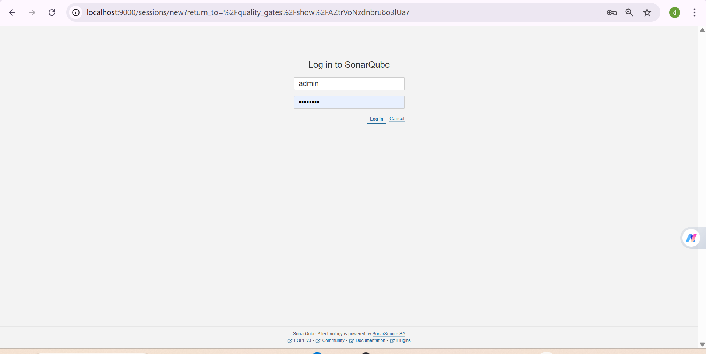

# TP-28-

##  Accès à SonarQube

L’interface SonarQube est accessible en local sur le port **9000**.  
Connexion avec les identifiants par défaut :

- **Username** : admin  
- **Password** : admin  

## . Démarrage de SonarQube avec Docker

## . Analyse Maven réussie

